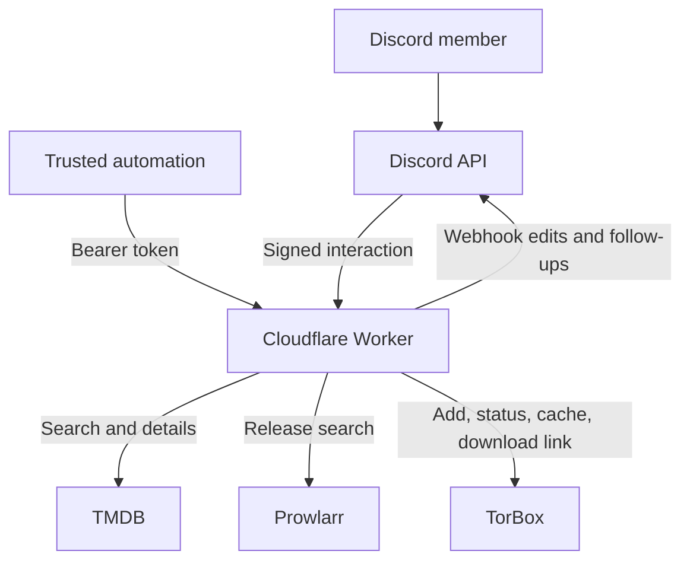
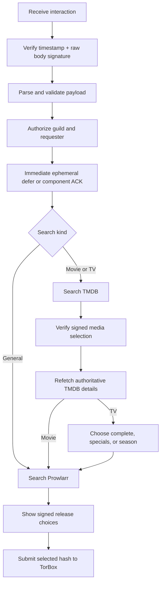
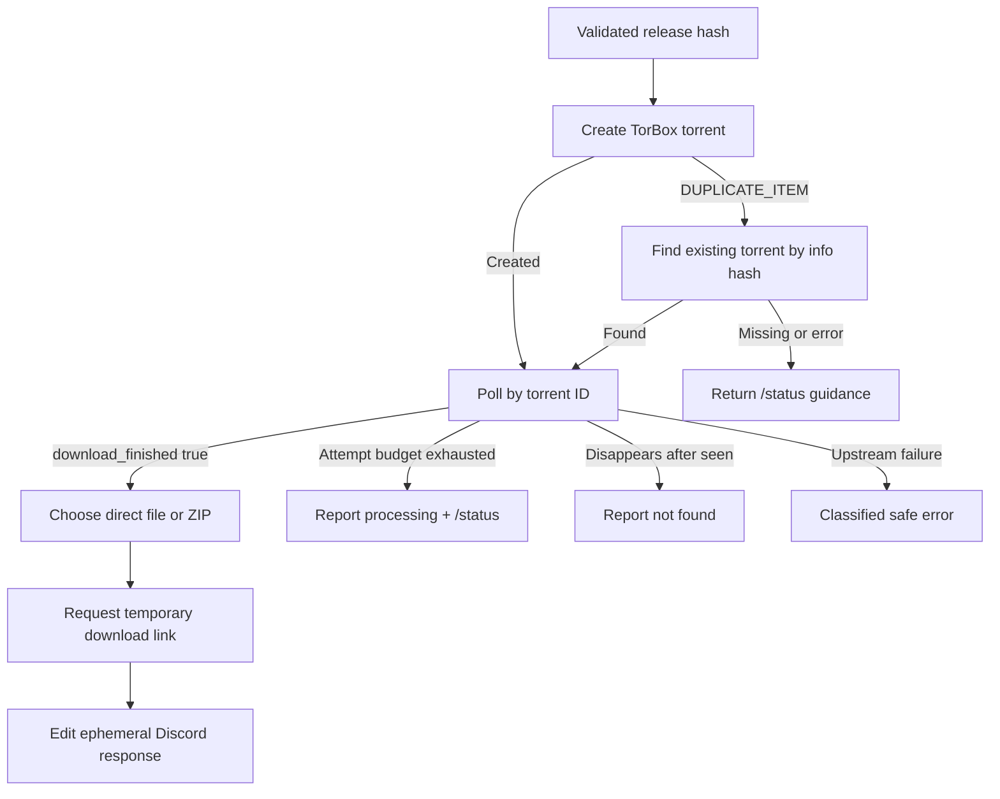

# TorrentBot architecture

TorrentBot is a stateless TypeScript Cloudflare Worker that connects Discord to
TMDB, Prowlarr, and TorBox. This guide focuses on boundaries and multi-step
behavior; setup and command details remain in the [README](../README.md).

## System boundaries

`src/index.ts` exposes a health response, the Discord interaction endpoint, and
the authenticated internal API. Discord and internal API requests share service
adapters and runtime configuration, but not authentication or response
semantics. The Worker has no KV, D1, Durable Object, queue, or other persistence;
continuation state is compactly signed into Discord components.

## Discord interaction and search lifecycle

Discord expects an initial interaction response within three seconds. The
Worker therefore performs only bounded validation before returning a deferred
ephemeral response or component acknowledgement. Network work continues through
`ctx.waitUntil()`, then edits the original response or a follow-up webhook
message.

General search bypasses TMDB. Movie and TV search presents normalized TMDB
matches; selecting one causes a fresh details lookup so titles, years, seasons,
and poster metadata do not come from client state. TV navigation signs and
validates season/page choices. Release menus contain validated BTIH hashes and
are bound to the initiating user, guild authorization, query digest, and a
15-minute expiry.

The ingress handler verifies Discord's Ed25519 signature before parsing JSON.
The current verifier signs the timestamp header together with the raw body; it
does not implement an additional timestamp-age window in repository code.

## Security and trust boundaries

- Discord request bodies, custom IDs, select values, message-derived query text,
  TMDB/Prowlarr/TorBox responses, and internal API bodies are untrusted inputs.
- Discord components use HMAC signatures, constant-time comparison, explicit
  size limits, expiry, requester binding, and guild authorization. Query text
  recovered from bot-authored message state must match the signed digest.
- Every `/api/*` route checks `Authorization: Bearer <INTERNAL_API_TOKEN>` before
  dispatch and returns a consistent JSON success/error envelope.
- Secrets come from Worker bindings or local `.dev.vars`; generated download
  links remain in ephemeral Discord output and are not persisted or logged.
- All upstream requests use configured hard timeouts and normalized errors so
  credential-bearing URLs and raw fetch failures are not exposed.

## TorBox submission and readiness

A selected result becomes a magnet containing only its validated info hash.
Normal creation returns a torrent ID. `DUPLICATE_ITEM` is recovered by locating
the existing torrent by hash rather than title. Readiness polling is bounded by
`TORBOX_POLL_MAX_ATTEMPTS`, waits `TORBOX_POLL_INTERVAL_MS` between attempts,
and gives each upstream call `UPSTREAM_TIMEOUT_MS`; only
`download_finished === true` means ready.

For a ready torrent, `selectDownloadTarget` returns one clear primary media file
only when the remaining files are recognized extras; ambiguous or multi-part
content uses a ZIP download. If polling times out, returns malformed data, loses
the torrent, or cannot create a link, the bot provides a sanitized outcome and
usually directs the member to `/status`. These failures do not create unbounded
background work or leak the temporary URL.
