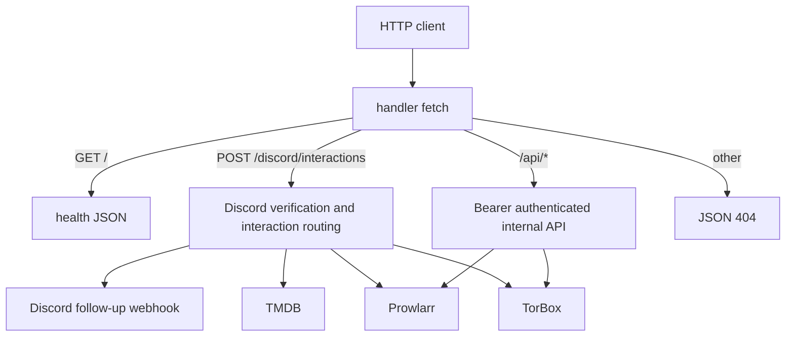

# Worker architecture and runtime boundaries

`src/index.ts` exports the Cloudflare Worker `handler`. The inspected Worker configuration declares no persistence or queue binding: each request is routed and any asynchronous Discord continuation is retained with `ExecutionContext.waitUntil`.

This shows the entrypoint dispatch and the outbound services each runtime surface can reach.

## Route contract

| Request | Owner | Authentication and response model |
| --- | --- | --- |
| `GET /` | `handler` | Unauthenticated health JSON: `ok`, service name, and `healthy` status. |
| `POST /discord/interactions` | [`handleDiscordInteractions`](discord-interactions.md#ingress-and-callback-lifecycle) | Raw-body Ed25519 verification, typed interaction parsing, Discord callback JSON, then deferred webhook edits where needed. |
| `/api/*` | [`handleApiRequest`](internal-api.md#routes-and-validation) | Every route requires the internal bearer token and returns `{ ok, ... }` JSON. |
| Anything else | `handler` | `{ ok: false, error: "Not found" }`, status 404. |

The two non-health surfaces intentionally do **not** share workflow semantics. Discord has a three-second interaction acknowledgement requirement, guild authorization, ephemeral messages, signed components, and follow-up webhooks. The internal API is plain bearer-authenticated request/response automation; it neither verifies Discord signatures nor creates Discord messages.

## Configuration boundary

`getConfig(env)` is the only runtime binding normalizer. It trims empty strings to `undefined`, applies a 10-second default upstream timeout, bounds TorBox polling values, and converts the guild allowlist into a deduplicated set. A malformed non-empty allowlist produces an empty set so Discord TorBox-facing access fails closed. See [security and reliability](security-and-reliability.md#configuration-and-authorization) for the binding categories and failure modes.

The Worker configuration names `src/index.ts` as the entrypoint, enables `nodejs_compat`, source-map upload, and observability. Its tracked `vars` hold timing controls; sensitive bindings are configured as Worker secrets. Generated `worker-configuration.d.ts` is a type mirror produced by `npm run cf-typegen`; change Wrangler bindings before regenerating it.

## Change navigation

| Change | Start here | Focused checks | Escalate when |
| --- | --- | --- | --- |
| Add or alter a route | `src/index.ts`, then the owning route module | `npm test -- --run test/index.spec.ts` | The route crosses Discord or bearer-auth boundaries: run its focused route suite. |
| Change a runtime binding/default | `src/config.ts`, `wrangler.jsonc`, `.dev.vars.example` | `npm test -- --run test/config.spec.ts` | A binding declaration changed: run `npm run cf-typegen` and `npm run typecheck`; do not hand-edit the generated declaration. |
| Change a shared upstream timeout | `src/utils/http.ts`, `src/config.ts` | `npm test -- --run test/config.spec.ts test/prowlarr.spec.ts test/torbox.spec.ts` | All adapters or user-visible error mapping change: use the relevant suites, not the whole test run by default. |

When changing the Discord route, continue to [Discord interactions](discord-interactions.md); when changing automation endpoints, continue to [internal API](internal-api.md).