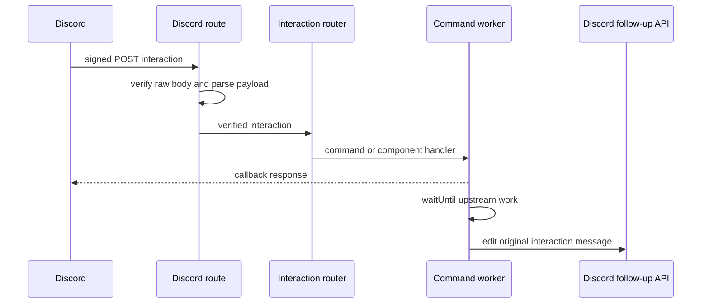

# Discord interaction ingress and signed component lifecycle

The Discord webhook is `POST /discord/interactions`, dispatched by the [Worker architecture](architecture-overview.md#route-contract). It is a public ingress, but it accepts an interaction only after `verifyDiscordRequest` validates Discord's Ed25519 signature over the exact timestamp plus raw body. Parsing happens only after verification; raw bodies, interaction tokens, and payloads are not logged.

This sequence shows the acknowledgement-before-upstream-work rule for deferred commands and asynchronous continuations.

## Ingress and callback lifecycle

`handleDiscordInteractions` returns 500 if the public key is absent; missing signature headers or an invalid signature return 401. Bad JSON and invalid interaction structure return 400. `routeInteraction` answers ping type 1, dispatches `/search`, `/add`, `/status`, and routes message components to `handleComponentInteraction`; unknown commands get an ephemeral explanation.

`src/discord/responses.ts` centralizes callback types: immediate ephemeral messages use type 4; deferred command responses use type 5 with ephemeral flag 64; deferred component updates use type 6; immediate component updates use type 7. Every bot response disables mentions. Deferred operations use `ctx.waitUntil` and `editOriginalResponse`, which PATCHes the original webhook response. The interaction-token URL is never exposed in normalized errors.

## Component safety contract

`src/utils/signing.ts` stores continuation state in compact `custom_id` values rather than persistence. Payloads are HMAC-SHA-256 signed with a 16-byte truncated base64url MAC and are rejected for malformed format, invalid signature, or expiry; the normal expiry window is 15 minutes. Payloads bind the original user ID and a digest of the original query, while select option values receive their own signatures. They do not contain secrets, full queries, or magnets.

Before a component can alter a message or submit a torrent, `handleComponentInteraction` verifies: a configured signing secret, custom-ID integrity and expiry, original requester identity, and authorized guild. Invalid, expired, cross-user, or unauthorized attempts receive ephemeral responses and leave the prior control intact. Media and season continuation additionally reconstruct the bot-authored query and compare its digest. The selected TMDB ID is re-fetched from TMDB rather than trusting menu title/year fields.

The [search and media workflow](search-and-media.md) owns the meaning of media, season, and release transitions; [torrent management](torrent-management.md) owns the selected-release submission and readiness outcome.

## Change navigation and test matrix

| Change | Primary symbols | Focused test behavior | Minimal validation |
| --- | --- | --- | --- |
| Signature ingress | `verifyDiscordRequest`, `handleDiscordInteractions` | Missing headers, bad signatures, malformed JSON, invalid interaction payload | `npm test -- --run test/discord.spec.ts` |
| Callback or deferred lifecycle | `routeInteraction`, response builders, `editOriginalResponse` | Ping, immediate errors, deferred ACK, original-message edit | `npm test -- --run test/discord.spec.ts test/discord-client.spec.ts` |
| Component payload format | `parseAndVerifyCustomId`, `build*CustomId`, `digestComponentQuery` | Valid/expired/tampered payload, requester isolation, 100-character limits | `npm test -- --run test/signing.spec.ts test/component.spec.ts` |
| New interaction command | `routeInteraction`, command module, `scripts/command-schema.mjs` | Dispatch and command-schema coverage | `npm test -- --run test/discord.spec.ts test/command-registration.spec.ts` |

A command schema change crosses a shipped Discord registration boundary: update the registration schema and handler together, then use `npm run discord:register` only in an intentionally configured development guild. Do not treat unit tests for a handler as proof that Discord can invoke the new command.