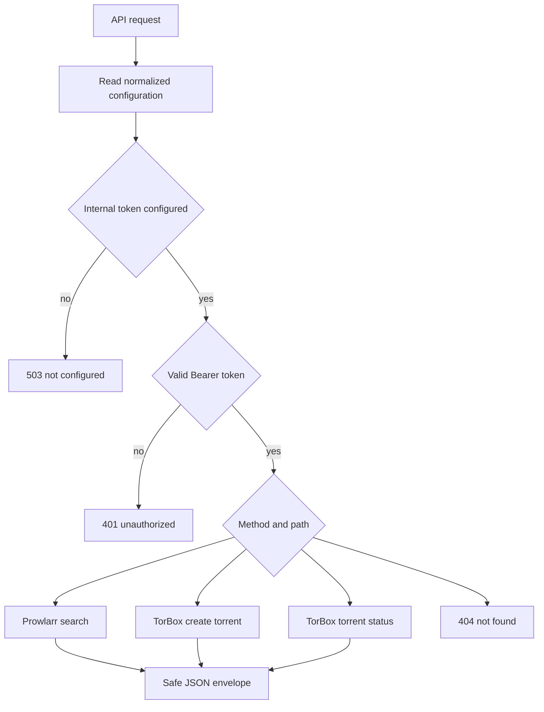

# Bearer-authenticated internal API

This is a server-to-server surface for automation, separate from [Discord interactions](discord-interactions.md#ingress-and-callback-lifecycle). The `handler` sends every `/api/` path to `handleApiRequest`; there is no Discord signature verification, guild gate, interaction deferral, or follow-up messaging.

Authentication requires `Authorization: Bearer <INTERNAL_API_TOKEN>`. `isValidBearer` accepts case-insensitive Bearer syntax and calls `safeSecretEqual`, which SHA-256 hashes both supplied and expected values before a fixed-length byte comparison. If the configured token is absent, all API routes return 503; missing or invalid authorization returns 401.

All responses have one of two envelopes: `{ "ok": true, ... }` or `{ "ok": false, "error": "..." }`. Error messages intentionally avoid upstream URLs and credentials.

This shows the authorization-before-dispatch ordering shared by every internal endpoint.

## Routes and validation

| Route | Input and limits | Success | Important exclusions |
| --- | --- | --- | --- |
| `POST /api/search` | JSON body at most 8192 characters; `query` is trimmed 1–200 chars; optional integer `limit` 1–25, default 5 | Query, count, and normalized Prowlarr results | No Discord components; response intentionally includes a magnet URI for authenticated automation. |
| `POST /api/torrents` | JSON body at most 8192 characters; `magnet` must pass magnet URI validation | 201 with TorBox torrent ID and hash | Duplicate TorBox item becomes 409. |
| `GET /api/torrents/:id` | Decimal, canonical non-negative integer | Serialized torrent status | Download URLs, file lists, and server paths are excluded. |

Bad JSON, oversized input, and invalid fields return 400. Missing upstream feature configuration returns 503. Timeouts become 504; upstream rate limiting becomes 429; other upstream status, parse, and network failures map to safe 502 responses. The common normalization and credential-safe error model are documented in [upstream integrations](upstream-integrations.md#shared-transport-and-errors).

## Serialization boundary

`serializeResult` exposes normalized release fields—including `magnetUri` because this surface is authenticated automation. In contrast, Discord release selection carries only safe display data and a validated hash through its signed interaction workflow. `serializeTorrent` intentionally omits temporary download URLs, TorBox file lists, and server paths even though the internal caller is authenticated.

## Change navigation

| Change | Start at | Tests and validation | Watch out for |
| --- | --- | --- | --- |
| Add/modify endpoint | `src/routes/api.ts` and `handleApiRequest` | `npm test -- --run test/api.spec.ts` | Preserve auth before route dispatch and the common JSON envelope. |
| Adjust input/output contract | owning `handle*` plus serializer | `npm test -- --run test/api.spec.ts` | Avoid exposing fields intentionally omitted by `serializeTorrent`; distinguish API-only magnet exposure from Discord behavior. |
| Change bearer auth | `src/utils/auth.ts` | `npm test -- --run test/api.spec.ts` | Keep fixed-size hash comparison rather than direct string equality. |
| Change upstream mapping | `upstreamFailure` and `src/utils/errors.ts` | `npm test -- --run test/api.spec.ts` plus relevant adapter suite | Never propagate raw URLs, response bodies, or secrets. |

This module is the public automation boundary. A new endpoint is incomplete until it is reachable from `/api/...`, covered by `test/api.spec.ts`, and its consumer-facing envelope is checked; testing an adapter in isolation is not sufficient.