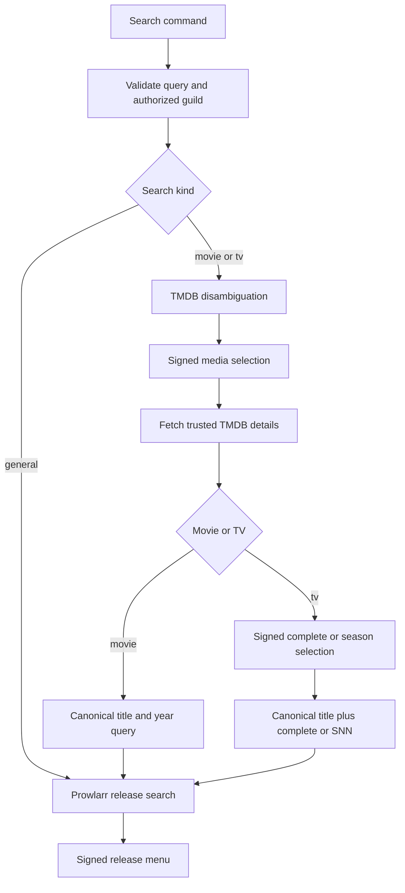

# Discord search, movie, and TV media workflow

`handleSearchCommand` accepts exactly `/search general|movie|tv query:<text>`, with a trimmed 1–200-character query. It checks the Discord guild allowlist and required configuration before returning an ephemeral deferred callback. The heavy work runs through `ctx.waitUntil`. The public ingress and component integrity checks belong to [Discord interactions](discord-interactions.md#component-safety-contract); adapters and their normalization rules belong to [upstream integrations](upstream-integrations.md).

This flow identifies when TMDB is used for canonicalization and when Prowlarr is the release-search authority.

## Search variants

- **General** calls `completeSearch` directly and never calls TMDB. It searches the submitted query through Prowlarr.
- **Movie** calls `searchTmdb("movie")`, renders up to ten upstream-order matches, and re-fetches `getTmdbDetails("movie", id)` after selection. The canonical Prowlarr query is title plus a valid year when one exists; an exact-search control uses the original query instead.
- **TV** calls `searchTmdb("tv")`, then re-fetches trusted TV details. It offers complete series, specials only when season 0 exists, each listed season, exact search, and navigation. `buildTvSeasonQuery` emits `<title> complete` or `<title> SNN`; it does not append a year, TMDB ID, episode count, or media label. Season number padding is at least two digits, not capped at two digits.

TV seasons are normalized, deduplicated by season number, numerically sorted, and displayed in pages of 20. This preserves Discord's select-menu limits while retaining all returned seasons.

## Release menu and cache enrichment

`completeSearch` requests 25 Prowlarr results, then `buildSelectableOptions` filters to valid info hashes, deduplicates, discards unusable labels, and caps the rendered menu at ten. If TorBox is configured, `checkTorrentCache` runs once for precisely that selectable set; cache status only adds a badge. A cache-check failure is logged as a sanitized classification and does not fail search or mutate TorBox.

<!-- openwiki: broken internal link [torrent-management.md#selected-release-lifecycle] heading anchor "selected-release-lifecycle" does not exist in "torrent-management.md". Fix the href or restore the target, then delete this comment. -->
When signing is configured, release options and custom IDs are requester-bound and query-digest-bound. Selecting a release moves into the [torrent management workflow](torrent-management.md#selected-release-lifecycle), which validates the signed selection again before submission.

## Transition invariants

- A media menu is not a trust source: TMDB details are fetched again using the signed numeric ID.
- Exact search is intentionally a bypass of canonicalization, but its original query is reconstructed from bot-authored content/footer and must match the signed digest.
- Cancellation replaces the message with a control-free cancellation state; back navigation uses signed IDs and re-runs trusted lookup.
- Missing Prowlarr configuration blocks all search. Movie/TV also require a TMDB token and component signing secret; general search does not require TMDB.
- Discord payload size and component constraints are checked by presentation/signing builders before edits.

## Change recipes and focused validation

| Change | Implementation seam | Focused tests | Minimal validation |
| --- | --- | --- | --- |
| Add a search variant | `SearchKind`, `extractSearchRoute`, `handleSearchCommand`, schema | Parsing rejects malformed nested options; command registration schema | `npm test -- --run test/commands.spec.ts test/command-registration.spec.ts` |
| Change TMDB choice/details flow | `completeMediaLookup`, `extractMediaSelection`, `processMediaComponentInteraction` | Re-fetches selected details, fallback exact query, tamper/replay handling | `npm test -- --run test/media-search.spec.ts test/component.spec.ts` |
| Change TV selection/query | `buildSeasonComponents`, `extractSeasonSelection`, `buildTvSeasonQuery` | Specials, high season numbers, pagination, exact and complete branches | `npm test -- --run test/season.spec.ts test/tv-season-flow.spec.ts` |
| Change release filtering/badges | `buildSelectableOptions`, `enrichWithCacheStatus`, `checkTorrentCache` | Invalid/duplicate hashes, cap behavior, advisory cache failure | `npm test -- --run test/selectable.spec.ts test/commands.spec.ts test/torbox.spec.ts` |

For any component format change, also run `npm test -- --run test/signing.spec.ts test/component.spec.ts`. Registration is a separate consumer boundary: after intentionally changing `scripts/command-schema.mjs`, use the configured-guild `npm run discord:register`; do not register commands merely to validate a local code-only change.