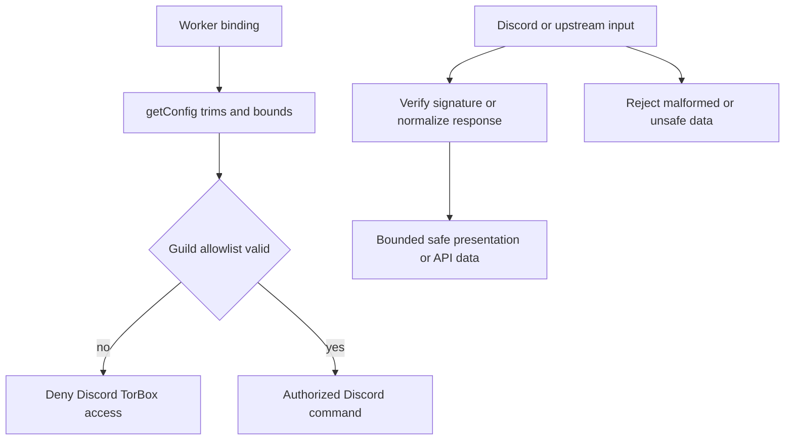

# Configuration, authorization, and reliability boundaries

The [Worker architecture](architecture-overview.md#configuration-boundary) centralizes runtime bindings through `getConfig`. Types generated from Wrangler do not guarantee a deployed secret exists, so every secret accessor trims strings and treats empty/missing values as `undefined`. Feature owners then return controlled messages rather than crashing.

## Configuration and authorization

`wrangler.jsonc` tracks only non-secret timing variables: `UPSTREAM_TIMEOUT_MS`, `TORBOX_POLL_INTERVAL_MS`, and `TORBOX_POLL_MAX_ATTEMPTS`. It declares the Worker entrypoint and required secret binding names, including service credentials, the internal API token, component-signing secret, and the Discord guild allowlist. `.dev.vars.example` is the non-sensitive local setup template; never read or document an actual `.dev.vars` file.

| Concern | Source of truth | Contract |
| --- | --- | --- |
| Discord webhook trust | `DISCORD_PUBLIC_KEY` | Missing key makes the interaction endpoint unavailable; valid requests must pass Ed25519 verification. |
| Discord TorBox authorization | `TORBOX_ALLOWED_GUILD_IDS`, `authorizeGuild` | Comma-separated snowflake-like IDs. Duplicate/blank pieces are harmless, but any malformed non-empty entry invalidates the entire set. Empty or malformed configuration, DMs, and unlisted guilds are denied. |
| Internal automation authorization | `INTERNAL_API_TOKEN`, `isValidBearer` | Every `/api/*` request requires Bearer auth with hashed fixed-length comparison. |
| Component authority | `COMPONENT_SIGNING_SECRET`, signing helpers | Interactions are signed, requester-bound, query-bound when applicable, and expire after 15 minutes. |
| Upstream reliability | `UPSTREAM_TIMEOUT_MS` | Valid range 1–60000; invalid/missing falls back to 10000 ms. |
| TorBox readiness budget | poll variables | Interval is 250–10000 ms and attempts 1–20; invalid/missing values use defaults of 2500 ms and seven attempts. |

## Data and output safety

This describes the fail-closed configuration path and the separate validation path for external data.

The system makes a strong distinction between trusted state and external values:

- The Discord route verifies raw signed input before parsing. Components add HMAC integrity, expiry, requester binding, and guild authorization; see [Discord interactions](discord-interactions.md#component-safety-contract).
- Prowlarr proxy URLs can embed an API key, so the adapter drops proxy download URLs and only retains raw magnets or synthesized info-hash magnets. TorBox link requests and Discord follow-ups build sensitive URLs internally and never put them in normalized errors. See [upstream integrations](upstream-integrations.md#cross-integration-invariants).
- User-visible Discord responses disable mention parsing. Status and generated TorBox links are ephemeral; links require HTTPS and are never logged.
- Input bounds include API body size, query length, search limits, magnet validation, numeric torrent IDs, Discord component size, select-option limits, and presentation validation.

## Failure behavior

Timeout, network, parse, status, and TorBox API failures are classified by `src/utils/errors.ts` and mapped to safe presentation/API messages. No raw upstream body or URL is returned. Cache enrichment and status link enrichment are intentionally best effort: their failures preserve the core Prowlarr result or status entry. Selected-release readiness polling is intentionally bounded and has no durable later notification; `/status` is the fallback.

## Change navigation

| Change | Start at | Focused validation | Avoid |
| --- | --- | --- | --- |
| Add/change binding or default | `src/config.ts`, `wrangler.jsonc`, `.dev.vars.example` | `npm test -- --run test/config.spec.ts` | Hand-editing `worker-configuration.d.ts`; regenerate with `npm run cf-typegen` if bindings changed. |
| Change guild policy | `parseAllowedGuildIds`, `authorizeGuild` | `npm test -- --run test/config.spec.ts test/commands.spec.ts` | Partial acceptance of malformed allowlists or making DMs an implicit allow. |
| Change security-sensitive component flow | `src/utils/signing.ts`, `src/commands/component.ts` | `npm test -- --run test/signing.spec.ts test/component.spec.ts` | Trusting client menu labels, IDs, or reconstructed queries without their signatures/digests. |
| Change error/timeout policy | `src/utils/http.ts`, `src/utils/errors.ts`, owning adapter | Relevant adapter suite | Returning a raw error, URL, payload, token, magnet, or temporary link. |

Run `npm run typecheck` after binding/type changes. The full test run and deployment are broader checks, appropriate when a change spans multiple surfaces or release preparation—not as the default focused validation.