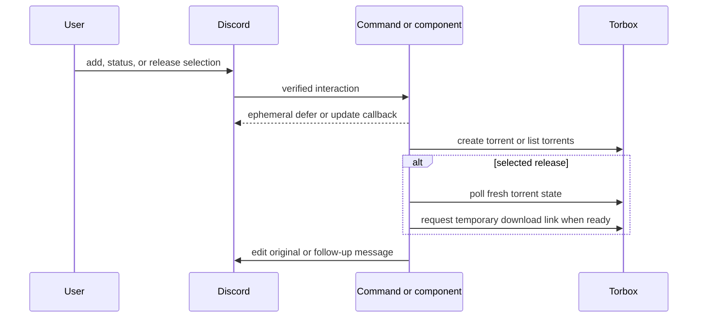

# TorBox submission, readiness, and status workflow

TorBox is one account behind the Discord workflows. Every `/add`, `/status`, and selected release first passes `authorizeGuild`; direct messages, unlisted guilds, and missing/empty/malformed allowlist configuration are denied. Commands defer ephemerally, then work in `ctx.waitUntil`. This gate is independent from the bearer-authenticated [internal API](internal-api.md), which can create torrents without Discord guild semantics.

This shows the asynchronous TorBox path. `/add` and `/status` edit their deferred original response; selected-release continuations either evolve the original interaction message or use an ephemeral follow-up, depending on the signed workflow state. All upstream work is bounded by timeouts and selected-release polling is additionally bounded.

## `/add` and selected release differ

`/add magnet:<uri>` validates the magnet URI and submits it through `createTorrent`, then reports TorBox's ID and hash. It does not poll for readiness or create a link.

A release selected from [search and media](search-and-media.md#release-menu-and-cache-enrichment) is stricter: it validates signed menu state, requester and guild; replaces the original message with a processing card; submits a bare info-hash magnet; recovers from TorBox `DUPLICATE_ITEM` by locating the existing torrent by case-insensitive info hash; and then runs `waitForTorrentReady`. It displays a ready download action, a processing result that points to `/status`, or a safe failure outcome. The duplicate recovery deliberately keys on hash rather than release title.

## Readiness and download-link rules

`waitForTorrentReady` immediately calls fresh `mylist?id=...` state, then waits between further calls until `maxAttempts`. It uses `download_finished === true`, not `download_state === "completed"`. If a torrent appears and later disappears, it returns `not-found`; if it has not yet appeared, it continues within the budget. Upstream errors stop polling.

Configuration defaults are 2500 ms and seven attempts; values are constrained to 250–10000 ms and 1–20 attempts. `getTorrentById` sets `bypass_cache=true` because polling needs fresh state. There is no persistent later notification: the Worker does not retain a monitoring job after the poll ends.

`selectDownloadTarget` returns a direct file only for exactly one file or one primary video plus recognized auxiliary files. Zero files, multiple primary videos, archive parts, or unknown companions use a whole-torrent ZIP. `requestDownloadLink` accepts only HTTPS URLs. Generated links are temporary and only put in ephemeral Discord output; they are never logged. The TorBox adapter sends the required `token` parameter for this endpoint, but errors intentionally omit request URLs.

## `/status`

`handleStatusCommand` lists the account, caps display at ten torrents, and processes ready entries sequentially for link enrichment. A failure to generate one link leaves that torrent visible without a placeholder and does not prevent other entries. Processing torrents receive no link. Progress is normalized from either a 0–1 fraction or 0–100 representation for display.

## Change navigation and behavioral matrix

| Change | Relevant symbols | Focused behavior to preserve | Minimal validation |
| --- | --- | --- | --- |
| Submission or duplicate recovery | `createTorrent`, `findTorrentByHash`, component processing | Invalid magnet, duplicate by hash, safe error presentation | `npm test -- --run test/torbox.spec.ts test/component.spec.ts` |
| Poll lifecycle | `waitForTorrentReady`, config bounds | Ready initial state, processing budget, absent-before-seen, disappears-after-seen, upstream error stops | `npm test -- --run test/torbox.spec.ts` |
| Link target or safety | `selectDownloadTarget`, `requestDownloadLink` | Single file, media plus extras, ambiguous bundle ZIP, rejected non-HTTPS URL | `npm test -- --run test/torbox.spec.ts test/commands.spec.ts` |
| Status presentation | `progressPercent`, `formatStatusMessage`, enrichment loop | Ready vs processing, per-item link failure isolation, ten-item cap | `npm test -- --run test/commands.spec.ts` |

Changing selected-release behavior crosses both signed Discord continuation and TorBox mutation boundaries. Run `test/component.spec.ts` with the TorBox tests; a TorBox-only unit test does not prove the requester-bound Discord workflow remains safe.